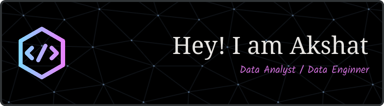

<!--  -->

# Contact me:

# 💫 About Me:

🔭 I’m currently working on  
Building my way up from a solid **Data Analyst** role toward becoming a full-stack **Data + AI Engineer** — bridging BI, backend pipelines, and intelligent agents.  

👯 I’m looking to collaborate on  
Projects involving **real-time data systems**, **LLM integrations**, **data tooling**, or anything wild and experimental that uses AI to solve real problems.

🤝 I’m looking for help with  
- Fine-tuning my **Kafka + Airflow** deployment knowledge in production setups  
- Architecting **RAG-based assistants** (Retrieval-Augmented Generation)  
- Better understanding **distributed systems** like Cassandra and horizontal scaling  

🌱 Currently learning  
- **PySpark** for big data transformation  
- **Apache Kafka** for stream processing  
- **Apache Airflow** for orchestration  
- **Cassandra & NoSQL** for distributed storage  
- **LLM internals** and RAG pipelines for smart assistants  
- How to integrate AI with **Cybersecurity CTFs**  

💬 Ask me about  
- Data pipelines, SQL kung-fu, and Power BI dashboards  
- Python for analytics and automation  
- Building stuff that makes data *dance and sing*

⚡ Fun fact  
I'm a **data guy who reads manhwa** with game mechanics and dreams of building an AI bot that can solo CTF challenges one day. I’m also wildly **intuitive and questioning** by nature — can't learn a thing unless I deeply understand how it *actually* works under the hood 😅

# 💻 Tech Stack:

### 🧱 Core Tools

 

### ⚙️ Data Engineering
      

### 🧠 ML / LLMs
       
 
 ### Data analysis and Visualization
  
   

 ### Frontend/backend tool
   
 
 ### 🔧 Dev Tools
 
    

### Personal tools
 

# 📊 GitHub Stats:
 
 

## 🏆 GitHub Trophies

### ✍️ Random Dev Quote

### 🔝 Top Contributed Repo

---

<!-- Proudly created with GPRM ( https://gprm.itsvg.in ) -->
